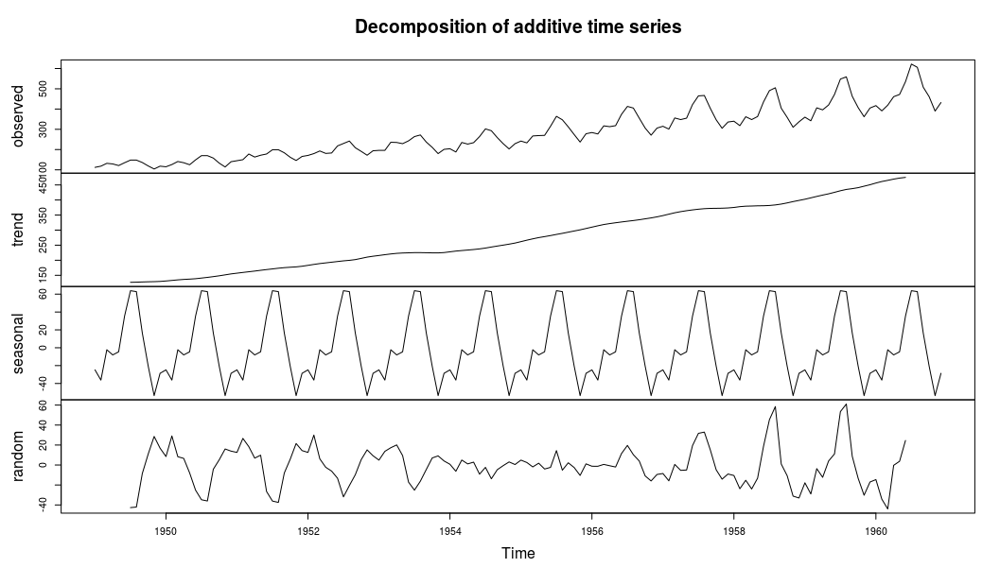
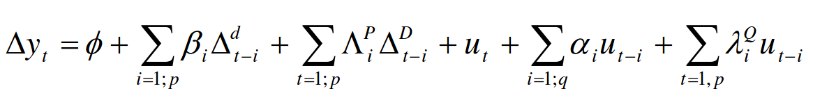
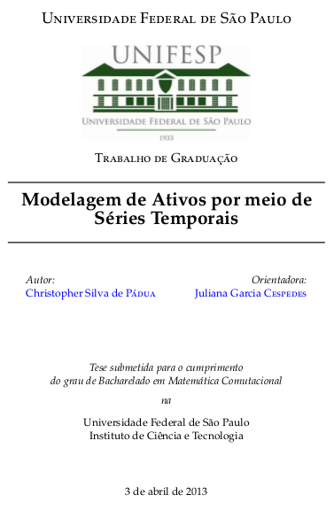
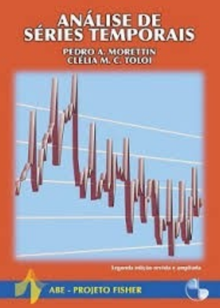
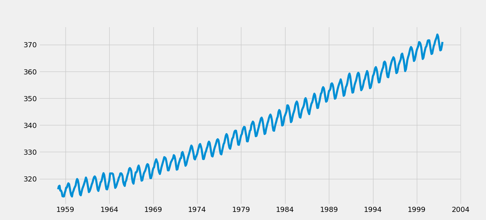
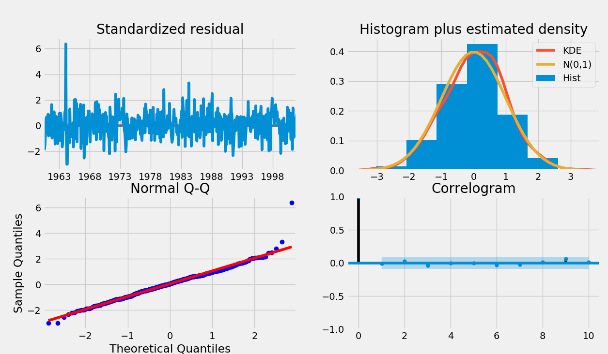
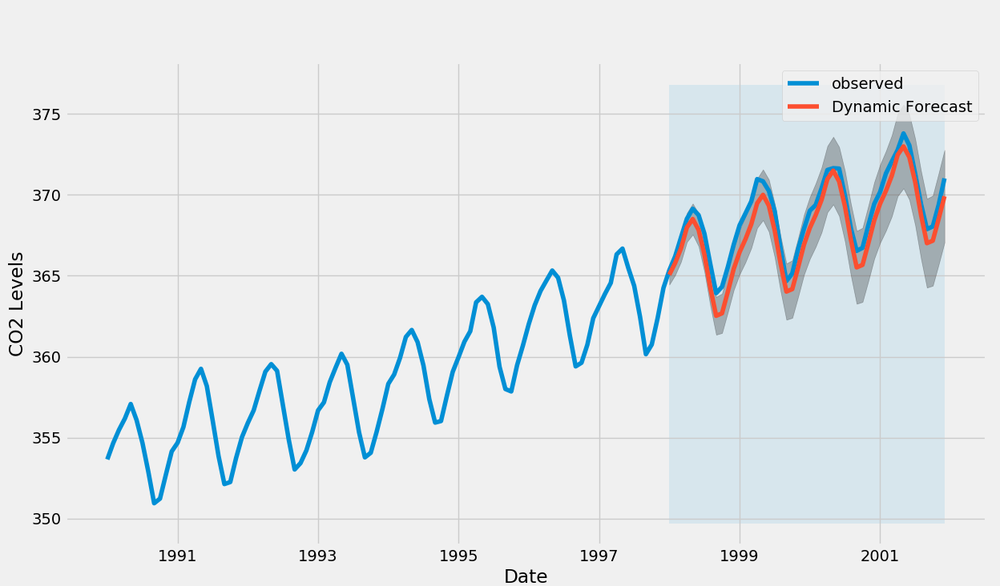
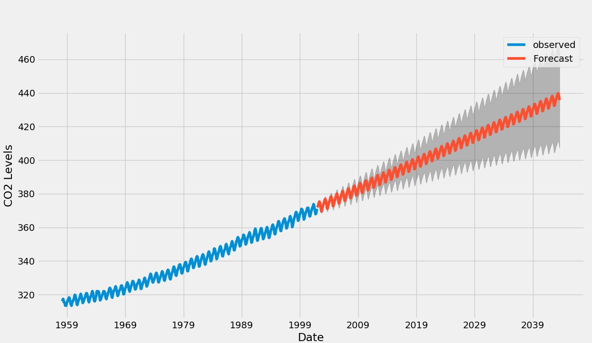

# Introdução a séries temporais

Podemos definir uma série temporal como uma variável em que há dependência entre as observações com relação ao tempo. Se considerarmos por exemplo a medição diária de temperatura no estado de São Paulo, o valor da temperatura hoje é dependente da temperatura nos últimos dias.

Uma série temporal é composta por três componentes, como visto na figura abaixo:

 - Tendência
 - Sazonalidade
 - Ruído 



O componente de tendência indica se a nossa variável possui um movimento de crescimento ou decrescimento constante ao longo do tempo. Já a componente sazonal revela a presença de periodicidade do nosso fator de estudo; se analisarmos quantidade de compras mensal no Brasil ao longo dos anos por exemplo, veremos que em determinados meses com datas comemorativas, como natal, ano novo e dias das crianças, teremos um pico de vendas que se repete ano a ano. Por fim, o ruído corresponde a um evento puramente aleatório e não correlacionado, geralmente com distribuição normal de média zero e variância constante.

Ciente da presença das três componentes supracitas de séries temporais, podemos modelar matematicamente cada uma delas. Para tanto é possível utilizar a classe de modelos chamada SARIMA (Seasonal Autoregressive Integrated Moving Average), cuja equação é apresentada abaixo. 



Para maiores informações a respeito da teoria desses modelos estatísticos de séries temporais recomendo as seguintes literaturas:

> Título: Modelagem de Ativos por meio de Séries Temporais
> Autor: Christopher Silva de Pádua
> Autor: Juliana Garcia Cespedes
> Tipo: TCC



> Título: Analise de Series Temporais
> Autor: Pedro Alberto Morettin
> Autor: Clelia M. C. Toloi
> Tipo: Livro



# Código de modelagem sarima automatizada com grid search

## Pré Requisitos
O script foi desenvolvido em python 3 e faz uso dos seguintes pacotes:

 - import warnings
 - import itertools
 - import pandas as pd
 - import numpy as np
 - import statsmodels.api as sm
 - import matplotlib.pyplot as plt
 - import math

Os usuários de ubuntu podem intalar o python 3 usando o seguinte comando

```
 sudo apt-get install python3
```

Para instalar pacotes é interessante ter instalado o pip3 pelo comando

```
 sudo apt-get install pip3
```

e assim instalar facilmente um pacote pelo comando

```
 sudo pip3 install nome_pacote
```
    
## Utilização

__Import packages__
Cada pacote abaixo auxilia em determinado processo no algorítimo. O pacote _statsmodels_ por exemplo contém o modelo SARIMA implementado

```
import warnings
import itertools
import pandas as pd
import numpy as np
import statsmodels.api as sm
import matplotlib.pyplot as plt
import math
```

O comando fixa um tema de display para os plots do pacote matplotlib
```
plt.style.use('fivethirtyeight')
```

__Import Data__
O código abaixo carrega e exibe os dados de emissão de CO2 em relação ao tempo, presentes no pacote _statsmodels_
```
#get object from statsmodel package
co2Data = sm.datasets.co2.load_pandas()
#get data form object
y = co2Data.data

# The 'MS' string groups the data in buckets by start of the month
y = y['co2'].resample('MS').mean()

# The term bfill means that we use the value before filling in missing values
y = y.fillna(y.bfill())

#set plot dimensions
y.plot(figsize=(15, 6))

#shows plot
plt.show()
```

Os dados estão organizados numa estrutura de pandas com as datas como index e uma coluna com os valores de CO2 formam a figura a baixo

|Index|co2|
|-|-|
|1958-03-01|316.1|
|1958-04-01|317.2|
|1958-05-01|317.43|
|1958-06-01|315.625|
|1958-07-01|315.625|
|1958-08-01|314.95|
|1958-09-01|313.5|



__Set Hiperparameters__
Para ajustar um modelo SARIMA aos dados são necessários alguns parâmetros

 - p: é a parte autorregressiva do modelo. Permite incorporar o efeito de valores passados no modelo. Intuitivamente isso é similar a dizer que é mais provável estar quente amanhã se esteve quente nos últimos p dias.
 - d: é a parte integrada do modelo. Inclui termos ao modelo que incorporam diferenças (i.e. o número de pontos passados para subtrair da data atual) ,para aplicar na série temporal. Intuitivamente isso é similar a dizer que é provável que a temperatura amanhã seja a mesma da atual se a diferença de temperatura dos últimos d dias é muito baixa.
 - q: é a parte de médias móveis do modelo. Isto permite determinar o erro do nosso modelo como uma combinação dos erros dos valores observados no passado.

Existem também os parâmetros P, D e Q análogos aos supracitados mas para a parte sazonal 

```
# Define the p, d and q parameters to take any integer value between 0 and 2
p = d = q = range(0, 2)

# Generate all different combinations of p, q and q triplets
pdq = list(itertools.product(p, d, q))

# Generate all different combinations of seasonal p, q and q triplets
seasonal_pdq = [(x[0], x[1], x[2], 12) for x in list(itertools.product(p, d, q))]
```

__Grid Search__

Existem formas visuais de se determinar os melhores valores dos parâmetros descritos acima, entretanto, pensando em automação, pode-se fazer um grid de possíveis parâmetros e testar a partir de uma métrica de ajuste qual o melhor modelo. No caso abaixo foi adotado o AIC (Akaike Information Criterion), que simboliza a distância entre o modelo ótimo e o modelo testado, de forma que quanto mais próximo a zero melhor o modelo.

```

```

__Fit Model__
Uma vez definido quais os melhores parâmetros podemos ajustar o modelo com esses parâmetros e checar a partir de gráfico de resíduos se o modelo atende as pressuposições necessárias e portanto pode ser utilizado. 




```
mod = sm.tsa.statespace.SARIMAX(y,
                                order=(1, 1, 1),
                                seasonal_order=(1, 1, 1, 12),
                                enforce_stationarity=False,
                                enforce_invertibility=False)

results = mod.fit()

results.plot_diagnostics(figsize=(15, 12))
plt.show()
```

__Predict__

Podemos prever valores para tempos já observados afim de comparar com os valores reais e verificar se estamos com um modelo preciso e bem ajustado.



```
pred_dynamic = results.get_prediction(start=pd.to_datetime('1998-01-01'), dynamic=True, full_results=True)
pred_dynamic_ci = pred_dynamic.conf_int()

ax = y['1990':].plot(label='observed', figsize=(20, 15))
pred_dynamic.predicted_mean.plot(label='Dynamic Forecast', ax=ax)

ax.fill_between(pred_dynamic_ci.index,
                pred_dynamic_ci.iloc[:, 0],
                pred_dynamic_ci.iloc[:, 1], color='k', alpha=.25)

ax.fill_betweenx(ax.get_ylim(), pd.to_datetime('1998-01-01'), y.index[-1],
                 alpha=.1, zorder=-1)

ax.set_xlabel('Date')
ax.set_ylabel('CO2 Levels')

plt.legend()
plt.show()
```

Ainda pensando em automação pode ser necessário ter uma métrica de controle por exemplo e para isso podemos calcular a raiz do erro quadrático médio, que mostra em média, quão distantes do valor real a nossa previsão está
```
# Extract the predicted and true values of our time series
y_forecasted = pred_dynamic.predicted_mean
y_truth = y['1998-01-01':]

# Compute the mean square error
rmse = math.sqrt(((y_forecasted - y_truth) ** 2).mean())
print('The Root Mean Squared Error of our forecasts is {}'.format(round(rmse, 2)))
```

Constatado que o nosso modelo funciona, podemos finalmente fazer a predição para uma janela de tempo não conhecida.



```
# Get forecast 500 steps ahead in future
pred_uc = results.get_forecast(steps=500)

# Get confidence intervals of forecasts
pred_ci = pred_uc.conf_int()

ax = y.plot(label='observed', figsize=(20, 15))
pred_uc.predicted_mean.plot(ax=ax, label='Forecast')
ax.fill_between(pred_ci.index,
                pred_ci.iloc[:, 0],
                pred_ci.iloc[:, 1], color='k', alpha=.25)
ax.set_xlabel('Date')
ax.set_ylabel('CO2 Levels')

plt.legend()
plt.show()
```
